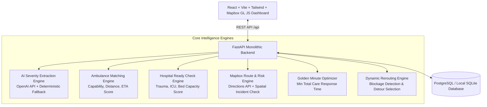

# LifeLine — Intelligent Emergency Response & Routing Platform

> **Hackathon Theme**: *Tech for a Better Tomorrow*  
> **Core Promise**: *"We're not just finding the nearest ambulance. We're finding the fastest reliable path from emergency to appropriate care."*

---

## 🚑 Project Overview

During critical emergencies, response time and clinical survival rates are governed by a synchronized sequence of decisions:
1. **What type and severity of emergency is this?** (AI Severity Extraction)
2. **Which available ambulance has the right clinical capability?** (Smart Ambulance Matching)
3. **Which hospital is actually ready with trauma & ICU facilities?** (Hospital Ready Check)
4. **Which route should the vehicle take to avoid active hazards?** (Mapbox Directions & Risk Analysis)
5. **What happens if the selected route becomes blocked?** (Dynamic Rerouting)
6. **Why did the system make each recommendation?** (Decision Explainability)

**LifeLine** coordinates these decisions in real time to optimize the **Golden Minute** — minimizing total latency from incident occurrence to arrival at appropriate medical care.

> [!NOTE]
> **Prototype / Hackathon Disclaimer**: This system utilizes simulated emergency resource, telemetry, and hospital capacity data for demonstration purposes. It does not connect to live municipal 911/108 hardware.

---

## 📐 Architecture



---

## ⚡ Key Features

- **AI Emergency Intake & NLP Extraction**: Converts conversational voice/text transcripts into structured incident metrics (type, patient counts, critical casualties, severity).
- **Smart Capability-Based Ambulance Matching**: Evaluates vehicles on ALS/ICU capabilities, medical equipment, proximity, and availability rather than naive distance alone.
- **Hospital Readiness Assessment**: Filters receiving facilities based on Level-1 trauma capability, active ICU capacity, and simulated open emergency beds.
- **Mapbox Multi-Route Calculation & Risk Assessment**: Dynamically assesses route options against real-time road incidents (accidents, floods, construction) to assign risk levels (`LOW`, `MEDIUM`, `HIGH`, `BLOCKED`).
- **Golden Minute Optimization**: Deterministically calculates the optimal combination minimizing total estimated response-to-care latency:
  $$\text{Total Time} = \text{Ambulance ETA} + \text{Transit ETA} + \text{Readiness Penalty}$$
- **Dynamic Rerouting**: Live triggers safe detours with real-time UI disruption telemetry when an active route is compromised.
- **Decision Transparency (`[WHY?]`)**: Instant human-readable justification for every dispatch decision.
- **Emergency Priority Lane Simulator**: Visualizes intersection green-wave preemptions saving up to 3 minutes during transit.

---

## 🛠 Tech Stack

- **Frontend**: React 18, Vite, TypeScript, Tailwind CSS, Mapbox GL JS, Lucide Icons, Axios, React Router.
- **Backend**: Python 3.13, FastAPI, Pydantic V2, SQLAlchemy, Uvicorn, HTTPX.
- **Database**: PostgreSQL (with automatic zero-config fallback to local SQLite for offline demos).
- **AI / Maps**: OpenAI API (`gpt-4o-mini`), Mapbox Directions API.

---

## 🚀 Quick Start Guide

### Prerequisites
- Python 3.10+
- Node.js 18+ and npm

### 1. Environment Setup
Copy `.env.example` to `.env`:
```bash
# Backend / Root .env
MAPBOX_ACCESS_TOKEN=your_mapbox_token
OPENAI_API_KEY=your_openai_api_key
DATABASE_URL=
FRONTEND_URL=http://localhost:5173
DEMO_MODE=true
```

```bash
# Frontend .env (in frontend/)
VITE_MAPBOX_ACCESS_TOKEN=your_mapbox_token
VITE_API_BASE_URL=/api
```

### 2. Backend Setup
```bash
# Install Python dependencies
pip install -r backend/requirements.txt

# Run backend server (starts on http://localhost:8000)
python backend/run.py
```
*API documentation automatically available at `http://localhost:8000/docs`.*

### 3. Frontend Setup
```bash
cd frontend
npm install
npm run dev
```
*Open `http://localhost:5173` in your browser.*

---

## 🧪 Running Automated Tests

Run the backend unit test suite covering severity parsing, ambulance capability scoring, hospital trauma filtering, route risk analysis, and Golden Minute optimization:

```bash
python -m pytest backend/tests/test_algorithms.py
```

---

## 🎬 11-Step Hackathon Hero Demo Flow

1. **Open Dashboard**: Navigate to `http://localhost:5173` (labeled **DEMO MODE**).
2. **Review Active Emergency**: Observe "Three people injured in a road accident near the railway bridge. One person is unconscious."
3. **AI Structured Extraction**: Triage registers `ROAD_ACCIDENT`, `CRITICAL` severity, 3 casualties (1 critical).
4. **Smart Ambulance Recommendation**: A-102 (Advanced ALS, 6m ETA) selected over nearer Basic unit because critical trauma requires ALS support. Click **`[WHY?]`** to inspect rationale.
5. **Hospital Ready Check**: City Trauma Center matched for Level-1 trauma capability and ICU availability. Click **`[WHY?]`** to inspect.
6. **Mapbox Route Analysis**: Compares Route A (High risk accident), Route B (Low risk clear corridor), Route C (Medium risk). Selects Route B.
7. **Golden Minute Optimization**: Calculates ~16 min total response-to-care time.
8. **Simulate Road Blockage**: Click **`[ SIMULATE BLOCKAGE ]`**.
9. **Disruption Alert**: Tactical alert banner activates with `"⚠ ROUTE DISRUPTION DETECTED. Recalculating..."`.
10. **Dynamic Reroute**: System shifts to Route C (`"✓ NEW ROUTE SELECTED — ETA: 10 min"`).
11. **Green Corridor Simulation**: Toggle **`[ ACTIVATE GREEN WAVE ]`** to simulate intersection traffic signal priority saving 3 minutes.

---

## 📄 License & Hackathon Notes
Developed for hackathon presentation under the MIT License.
